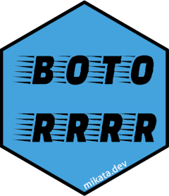

# botor: Reticulate wrapper on 'boto3' <a href="https://daroczig.github.io/botor/"></a>

<!-- badges: start -->
[](https://www.repostatus.org/#active)  [](https://github.com/daroczig/botor/actions/workflows/R-CMD-check.yaml) [](https://app.codecov.io/gh/daroczig/botor)
<!-- badges: end -->

This R package provides raw access to the 'Amazon Web Services' ('AWS') 'SDK' via the 'boto3' Python module and some convenient helper functions (currently for S3 and KMS) and workarounds, eg taking care of spawning new resources in forked R processes.

## Installation

This package requires Python to be installed along with the `boto3` Python module, which can be installed from R via:

```r
reticulate::py_install('boto3')
```

If that might result in technical problems that you cannot solve, then it's probably easier to install a standalone Python along with the system dependencies etc via [`rminiconda`](https://github.com/hafen/rminiconda).

Once the Python dependencies are resolved, you can either install from CRAN or the most recent (development version) of `botor` can be installed from  GitHub:

```r
remotes::install_github('daroczig/botor')
```

## Loading the package

Loading the `botor` package might take a while as it will also `import` the `boto3` Python module in the background:

```r
system.time(library(botor))
#>    user  system elapsed
#>   1.131   0.250   1.191
```

## Getting started

Quick examples:

1. Check the currently used AWS user's name:

    ```r
    iam_whoami()
    #> [1] "gergely-dev"
    ```

2. Read a `csv` file stored in S3 using a helper function:

    ```r
    s3_read('s3://botor/example-data/mtcars.csv', read.csv)
    #>     mpg cyl  disp  hp drat    wt  qsec vs am gear carb
    #> 1  21.0   6 160.0 110 3.90 2.620 16.46  0  1    4    4
    #> 2  21.0   6 160.0 110 3.90 2.875 17.02  0  1    4    4
    #> ...
    ```

3. Encrypt a string via KMS using a helper function:

    ```r
    kms_encrypt('alias/key', 'secret')
    #> [1] "QWERTY..."
    ```

4. Get more info on the currently used AWS user calling the IAM client directly:

    ```r
    iam()$get_user()
    ```

5. Create a new client to a service without helper functions:

    ```r
    ec2 <- botor_client('ec2')
    ec2$describe_vpcs()
    ```

## AWS Auth

The `botor` package by default will use the credentials and related options set in [environmental variables](https://boto3.amazonaws.com/v1/documentation/api/latest/guide/configuration.html#configuration) or in the `~/.aws/config` and `~/.aws/credentials` files. If you need to specify a custom profile or AWS region etc, there are various options with different complexity and flexibility:

* set the related environment variable(s) before loading `botor`
* call the `botor()` function with the relevant argument to set the config of the default session for the `botor` helper functions, eg

```r
botor(region_name = 'eu-west-42')
```

* if you need to manage multiple sessions, then use the raw `boto3` object from the `botor` package and `boto3.session.Session` to init these custom sessions and the required clients/resources on the top of those, eg

```r
my_custom_session1 <- boto3$Session(region_name = 'us-west-1')
my_custom_s3_client1 <- my_custom_session1$client('s3')
my_custom_session2 <- boto3$Session(region_name = 'us-west-2')
my_custom_s3_client2 <- my_custom_session2$client('s3')
```

## Using the raw `boto3` module

The `botor` package provides the `boto3` object with full access to the `boto3` Python SDK. Quick example on listing all S3 buckets:

```r
library(botor)
s3 <- boto3$resource('s3')
library(reticulate)
iter_next(s3$buckets$pages())
```

Note that this approach requires a stable understanding of the `boto3` Python module, plus a decent familiarity with `reticulate` as well (see eg `iter_next`) -- so you might want to rather consider using the helper functions described below.

## Using the default `botor` session

Calling `botor()` will provide you a default `boto3` session that is cached internally. You can always override the default session by calling `botor()` again with new arguments. See eg setting the default `boto3` session to use `us-west-2`:

```r
botor(region_name = 'us-west-2')
botor()$resource('s3')
```

A great advantage of using `botor()` instead of custom sessions is that it's fork-safe. See eg:

```r
attr(botor(), 'pid')
#> [1] 31225
attr(botor(), 'pid')
#> [1] 31225

lapply(1:2, function(i) attr(botor(), 'pid'))
#> [[1]]
#> [1] 31225
#>
#> [[2]]
#> [1] 31225

mclapply(1:2, function(i) attr(botor(), 'pid'), mc.cores = 2)
#> [[1]]
#> [1] 13209
#>
#> [[2]]
#> [1] 13210
```

## Convenient helper functions

Besides the `botor` pre-initialized default Boto3 session, the package also provides some further R helper functions for the most common AWS actions, like interacting with S3 or KMS. Note, that the list of these functions is pretty limited for now, but you can always fall back to the raw Boto3 functions if needed. PRs on new helper functions are appreciated :)

Examples:

1. Listing all S3 buckets takes some time as it will first initialize the S3 Boto3 client in the background:

    ```r
    system.time(s3_list_buckets())[['elapsed']]
    #> [1] 1.426
    ```

2. But the second query is much faster as reusing the same `s3` Boto3 resource:

    ```r
    system.time(s3_list_buckets())[['elapsed']]
    #> [1] 0.323
    ```

3. Unfortunately, sharing the same Boto3 resource between (forked) processes is not ideal, so `botor` will take care of that by spawning new resources in the forked threads:

    ```r
    library(parallel)
    simplify2array(mclapply(1:4, function(i) system.time(s3_list_buckets())[['elapsed']], mc.cores = 2))
    #> [1] 1.359 1.356 0.406 0.397
    ```

4. Want to speed it up more?

    ```r
    library(memoise)
    s3_list_buckets <- memoise(s3_list_buckets)
    simplify2array(mclapply(1:4, function(i) system.time(s3_list_buckets())[['elapsed']], mc.cores = 2))
    #> [1] 1.330 1.332 0.000 0.000
    ```

The currently supported resources and features via helper functions: https://daroczig.github.io/botor/reference/index.html

## Error handling

The convenient helper functions try to suppress the boring Python traceback and provide you only the most relevant information on the error. If you want to see the full tracelog and more details after an error, call `reticulate::py_last_error()`. When working with the raw `boto3` wrapper, you may find `botor:::trypy` useful as well.

```r
s3_download_file('s3://bottttor/example-data/mtcars.csv', tempfile())
#> Error in s3_download_file("s3://bottttor/example-data/mtcars.csv", tempfile()) :
#>   Python `ClientError`: An error occurred (404) when calling the HeadObject operation: Not Found

s3_read('s3://botor/example-data/mtcars2.csv', read.csv)
#> Error in s3_download(object, t) :
#>   Python `ClientError`: An error occurred (403) when calling the HeadObject operation: Forbidden

botor(region_name = 'us-west-2')
s3_read('s3://botor/example-data/mtcars.csv', read.csv)
#>     mpg cyl  disp  hp drat    wt  qsec vs am gear carb
#> 1  21.0   6 160.0 110 3.90 2.620 16.46  0  1    4    4
#> 2  21.0   6 160.0 110 3.90 2.875 17.02  0  1    4    4
#> ...
```

## Logging

`botor` uses the [`logger`](https://daroczig.github.io/logger/) package to write log messages to the console by default with the following log level standards:

* `TRACE` start of an AWS query (eg just about to start listing all S3 buckets in an AWS account)
* `DEBUG` summary on the result of an AWS query (eg number of S3 buckets found in an AWS account)
* `INFO` currently not used
* `WARN` currently not used
* `ERROR` something bad happened and logging extra context besides what's being returned in the error message
* `FATAL` currently not used

The default log level threshold set to `DEBUG`. If you want to update that, use the package name for the `namespace` argument of `log_threshold` from the `logger` package, eg to enable all log messages:

```r
library(logger)
log_threshold(TRACE, namespace = 'botor')

s3_download_file('s3://botor/example-data/mtcars.csv', tempfile())
#> TRACE [2019-01-11 14:48:07] Downloading s3://botor/example-data/mtcars.csv to '/tmp/RtmpCPNrOk/file6fac556567d4' ...
#> DEBUG [2019-01-11 14:48:09] Downloaded 1303 bytes from s3://botor/example-data/mtcars.csv and saved at '/tmp/RtmpCPNrOk/file6fac556567d4'
```

Or update to not fire the less important messages than warnings:

```r
library(logger)
log_threshold(WARN, namespace = 'botor')
```

You can use the same approach to set custom (or more than one) log appenders, eg writing the log messages to files, a database etc -- check the `logger` docs for more details.

## Why the name?

`botor` means "goofy" in Hungarian. This is how I feel when looking back to all the dev hours spent on integrating the AWS Java SDK in R -- this includes `AWR.KMS`, where I ended up debugging and fixing many issues in forked processes, but `AWR.Kinesis` still rocks :)

The name also reminds you that it's not exactly `boto3`, as eg you have to use `$` instead of `.` to access methods.
